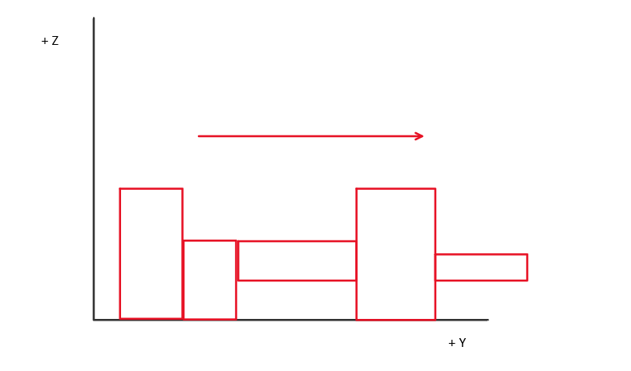
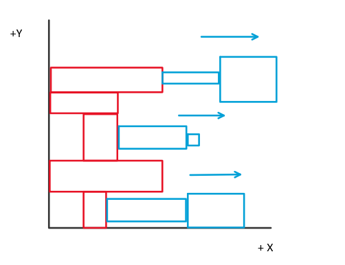
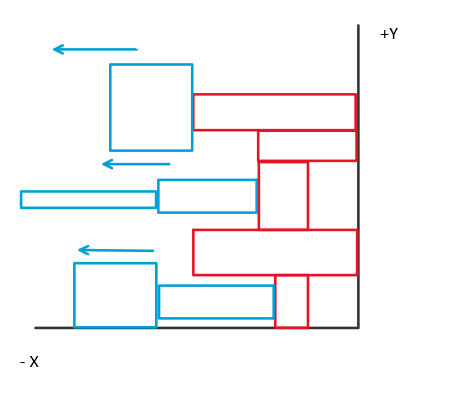
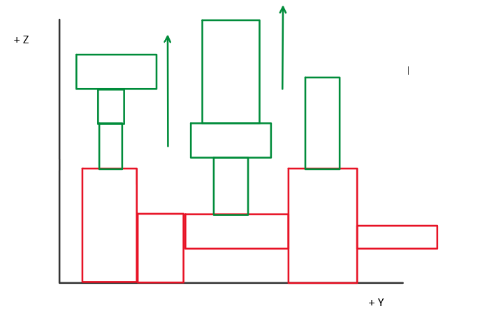

# ludobots

## Running my code

To run the code, simply run 'simulate_for_assignment_7.py'.

## What is this
Coming soon... 
## Description of how bodies and brains are generated

The program starts by creating a random number of links of varying dimensions in the +y direction. The first link is
created with absolute positioning, while the rest are positioned relative to the previous link.

Next, the program loops through each link in the +y direction and attach a random number of links in the +x direction.

The same is repeated for the -x direction.

Lastly, the program loops through the links in the +y direction again and grow a random number of links in the +z
direction, as shown below.

Generating the links in this fashion ensures that they won't grow inside each other. In addition, at each step of the
generation, a random coin is flipped to decide whether a sensor should be placed on the link or not. 

Subsequently, a neural network is created by adding a sensor neuron for each block that is equipped with a sensor.
Motor neurons are then attached to every link. Lastly, I loop through every motor neuron and connect it to all the
sensor neurons, thus completing the construction of the brain.

## Video:

https://youtube.com/shorts/agWQ7bNAbu0?feature=share

## Resources

https://www.reddit.com/r/ludobots/
https://www.thunderheadeng.com/pyrosim 

