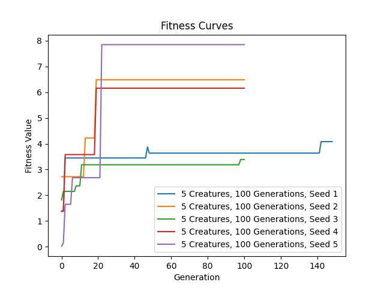

# ludobots

## Running my code

To run the code, simply run 'search.py'. You can also provide an additional positive integer as parameter if you want to
reproduce the result from a certain run. For example, search.py 3 will reproduce the results from the 3rd run.

## Description of how bodies and brains are generated

The program starts by creating a random number of links of varying dimensions in the +y direction. The first link is
created with absolute positioning, while the rest are positioned relative to the previous link.

Next, the program loops through each link in the +y direction and attach a random number of links in the +x direction.

The same is repeated for the -x direction.

Lastly, the program loops through the links in the +y direction again and grow a random number of links in the +z
direction, as shown below.

Generating the links in this fashion ensures that they won't grow inside each other. In addition, at each step of the
generation, a random coin is flipped to decide whether a sensor should be placed on the link or not.

Subsequently, a neural network is created by adding a sensor neuron for each block that is equipped with a sensor.
Motor neurons are then attached to every link. Lastly, I loop through every motor neuron and connect it to all the
sensor neurons, thus completing the construction of the brain.

## How the brain and body mutate

At each evolutionary step, the program does the following mutation:

1. Randomly selecting a weight to modify and replacing its value with a new random value between -1 and 1.
2. Randomly flipping a sensor value for each of the four sensor directions (y, x, -x, and z).
3. Randomly changing the size of a randomly selected link in one of the four directions (y, x, -x, and z).

## Evolved behavior:
The robot should move further and further into the screen (in the -x direction)

## Fitness Curve:

## Video:

https://youtube.com/shorts/7d0gmsEixBk?feature=share

## Resources

https://www.reddit.com/r/ludobots/
https://www.thunderheadeng.com/pyrosim 

