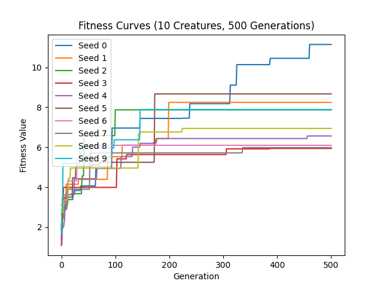

# Ludobots Final Project

## Description

This repository contains my course project for CS 396 Artificial Life. This codebase demonstrates an experiment on
evolved robots, exploring how the size of body parts affects evolution's effectiveness for locomotion. A fitness
function rewards robots traveling further into the screen (-x direction) during the simulation. Random mutations occur over
time, and fitter robots are selected. Evolution happens through both body plan and brain weight modifications. 


## Running my code

Make sure you have Python 3 installed.
To run the code, simply run the command

```
python search.py
```

You can also provide an additional positive integer as parameter if you want to
reproduce the result from a certain run. For example,

```
 search.py 3
```

will reproduce the results from the 3rd run.

## Description of how bodies and brains are generated

For more details, check out `solution.py`.

### Body Generation

The program starts by creating a random number of links of varying dimensions in the +y direction. The first link is
created with absolute positioning, while the rest are positioned relative to the previous link.


Next, the program loops through each link in the +y direction and attach a random number of links in the +x direction.


The same is repeated for the -x direction.


Lastly, the program loops through the links in the +y direction again and grow a random number of links in the +z
direction, as shown below.


Generating the links in this fashion ensures that they won't grow inside each other.

### Brain Generation

To equip the robot with sensors, a coin is flipped for each link of the robot to decide whether to place a sensor on it.
If the coin lands on heads, a sensor neuron is attached to the link. Then, a motor neuron is attached to each joint of
the robot, except for the last one. The neural network also includes a layer of hidden neurons that receive input from
the sensor neurons and output values to the motor neurons. This connects each sensor neuron to every motor neuron,
enabling the sensors to influence the movements of the robot.


## Robot Evolution

### How the brain and body mutate

At each evolutionary step, the program performs the following mutation:

1. Randomly selecting a synaptic weight to modify and replacing its value with a new random value between -1 and 1.


2. Randomly adding or removing sensor for each link in the four major directions (y, x, -x, and z).


3. Randomly changing the size of a randomly selected link in one of the four directions (y, x, -x, and z).


### Selection

To select the fittest robot in each generation, I utilize the parallel hill climber technique. This approach
involves creating a group of several robots and generating a child with a random mutation for each member of the parent
population in every generation. The robot with the highest fitness score among the parent and child is then
chosen to advance to the next generation. This process is repeated at each generation, leading to the selection of more
competent robots as time progresses. The diagram below provides a visual representation of this procedure.


### Evolved behavior:

The robot should move further and further into the screen (in the -x direction)

## Simulation Setup and Result

A total of 10 x 500 x 10 =50,000 simulations were run. The main program (search.py) was run 10 times. For each run ,the
evolution unfolded for 500 generations with a population size of 10.

### Fitness Curve:

During each simulation, the fitness of the most fit creature was recorded. The plot below shows how the fitness changes
overtime.  


## 2-minute Summary Video:

https://youtu.be/-tN431T1qm8

## Resources

https://www.reddit.com/r/ludobots/ 

https://www.thunderheadeng.com/pyrosim 

